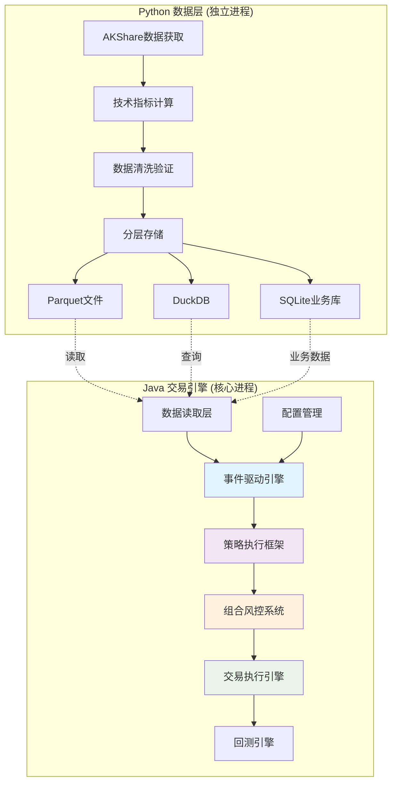

# QuantCapital Java交易引擎

[](https://openjdk.java.net/projects/jdk/21/)
[](https://spring.io/projects/spring-boot)
[](https://maven.apache.org/)
[](LICENSE)

> 🚀 **高性能Java量化交易引擎** - 基于事件驱动架构的混合语言量化交易系统

## 📋 项目概述

QuantCapital Java交易引擎是一个高性能的量化交易系统核心组件，采用**Python+Java混合架构**设计：

- **Python端**：负责数据获取与存储（AKShare、技术指标计算、Parquet文件、DuckDB、SQLite）
- **Java端**：负责事件驱动引擎及整个回测/实盘交易流程

### 🎯 核心特性

| 特性 | 技术实现 | 性能指标 |
|------|----------|----------|
| **高性能** | Java 21虚拟线程 + ZGC | 万级TPS事件处理 |
| **低延迟** | 优先级队列 + 异步处理 | <1ms事件分发 |
| **数据兼容** | Tablesaw + Apache Parquet | 完美读取Python数据 |
| **智能策略** | 三类策略分离设计 | 开单/止损/强制止损 |
| **风控完善** | 多层次风控检查 | 实时仓位监控 |
| **配置灵活** | Spring Boot配置 | 回测/实盘无缝切换 |

## 🏗️ 架构设计



### 🔧 技术栈

#### Java端核心技术
- **框架**: Spring Boot 3.2 + JDK 21 + Maven 3.8+
- **数据处理**: Tablesaw + Apache Arrow + Apache Parquet
- **数据库**: DuckDB JDBC + SQLite JDBC
- **并发**: 虚拟线程 + BlockingQueue + ThreadPool
- **性能**: ZGC垃圾收集器 + 内存映射文件
- **序列化**: Jackson + Lombok
- **测试**: JUnit 5 + Mockito + AssertJ

#### 性能优化特性
- ⚡ **ZGC低延迟GC**: 停顿时间 < 10ms
- 🧵 **虚拟线程**: Project Loom，支持百万级并发
- 🗃️ **Apache Arrow**: 内存列式存储，高效数据交换
- 📊 **DuckDB**: 内存分析数据库，列式查询优化

## 🚀 快速开始

### 1. 环境准备

```bash
# 检查Java版本（必须21+）
java --version

# 检查Maven版本
mvn --version

# 系统要求
# - Java 21+ (支持虚拟线程)
# - Maven 3.8+
# - 内存: 8GB+
# - 存储: 10GB+
```

### 2. 项目构建

```bash
# 1. 克隆项目
git clone https://github.com/your-org/quant-trading-java.git
cd quant-trading-java

# 2. 编译项目
mvn clean compile

# 3. 运行测试
mvn test

# 4. 启动应用
mvn spring-boot:run
```

### 3. 启动模式

```bash
# 回测模式
mvn spring-boot:run -Dspring.profiles.active=backtest

# 实盘模式
mvn spring-boot:run -Dspring.profiles.active=live

# 性能模式（生产环境）
java -XX:+UseZGC \
     -XX:+UnlockExperimentalVMOptions \
     -Xmx8g \
     --enable-preview \
     -jar target/quant-trading-java-1.0.0.jar
```

## 📊 数据接入

### Python数据准备

确保Python端已生成以下数据结构：

```
data/
├── kline/                    # K线数据（Parquet格式）
│   ├── frequency=daily/      # 日线数据
│   │   ├── year=2023/
│   │   └── year=2024/
│   ├── frequency=hourly/     # 小时数据
│   └── frequency=weekly/     # 周线数据
├── business.db              # SQLite业务数据库
│   ├── calendar             # 交易日历
│   ├── universe             # 股票池
│   └── stock_info           # 股票基本信息
└── indicators/              # 技术指标数据
```

### 数据验证

```bash
# 健康检查
curl http://localhost:8080/api/actuator/health

# 数据统计
curl http://localhost:8080/api/data/statistics
```

## 🧠 策略开发

### 1. 策略分类

| 策略类型 | 职责 | 关注范围 | 示例 |
|----------|------|----------|------|
| **开单策略** | 寻找开仓机会 | 全市场 - 已持仓 | 均线金叉买入 |
| **止盈止损策略** | 管理已有持仓 | 仅持仓标的 | 固定比例止损 |
| **通用强制止损** | 兜底风控 | 所有持仓 | 最大回撤保护 |

### 2. 策略开发示例

```java
@Component
public class MACrossStrategy implements BaseStrategy {
    
    private static final String STRATEGY_ID = "ma_cross_strategy";
    
    @Override
    public List<Signal> onMarketEvent(MarketEvent event) {
        Bar bar = event.getBar();
        
        // 检查技术指标数据
        if (bar.getMa5() == null || bar.getMa20() == null) {
            return List.of();
        }
        
        List<Signal> signals = new ArrayList<>();
        
        // 金叉买入逻辑
        if (bar.getMa5() > bar.getMa20() && isGoldenCross(bar)) {
            Signal buySignal = new Signal(
                STRATEGY_ID,
                bar.getSymbol(),
                SignalDirection.BUY,
                0.8,  // 信号强度
                LocalDateTime.now(),
                bar.getClose(),
                "MA5上穿MA20金叉信号"
            );
            signals.add(buySignal);
        }
        
        return signals;
    }
    
    @Override
    public String getStrategyId() { return STRATEGY_ID; }
    @Override
    public StrategyType getStrategyType() { return StrategyType.ENTRY; }
    // ... 其他必须实现的方法
}
```

## 🛡️ 风控系统

### 多层次风控检查

```java
// 1. 仓位限制
portfolio.max-position-percent: 5.0          # 单标的≤5%
portfolio.max-total-position-percent: 95.0   # 总仓位≤95%

// 2. 资金管理
portfolio.min-order-amount: 1000.0           # 最小下单金额

// 3. 风险监控
portfolio.risk.max-daily-loss-percent: 2.0   # 日亏损≤2%
portfolio.risk.max-drawdown-percent: 10.0    # 最大回撤≤10%

// 4. 合规检查
- ST股票限制
- 新股检查
- 涨跌停过滤
```

## 📈 回测功能

### 1. 配置回测参数

```yaml
quantcapital:
  backtest:
    start-date: "2023-01-01"
    end-date: "2023-12-31"
    universe: ["000001.SZ", "000002.SZ", "399001.SZ"]
    frequency: "daily"
    
  account:
    initial-capital: 1000000.0
    
  execution:
    slippage: 0.001              # 0.1%滑点
    commission-rate: 0.0003      # 0.03%手续费
```

### 2. 运行回测

```java
@RestController
public class BacktestController {
    
    @PostMapping("/api/backtest/start")
    public ResponseEntity<String> startBacktest(@RequestBody BacktestRequest request) {
        BacktestEngine engine = new BacktestEngine(request.getConfig());
        BacktestResult result = engine.run();
        return ResponseEntity.ok(result.toJson());
    }
}
```

## 🔍 监控调试

### 系统监控端点

| 端点 | 功能 | 示例响应 |
|------|------|----------|
| `/api/actuator/health` | 健康检查 | UP/DOWN状态 |
| `/api/actuator/metrics` | 性能指标 | JVM、业务指标 |
| `/api/engine/stats` | 事件引擎统计 | 处理速度、队列大小 |
| `/api/strategies/performance` | 策略性能 | 收益率、胜率 |

### 日志配置

```yaml
logging:
  level:
    com.quantcapital.engine: DEBUG    # 事件引擎详细日志
    com.quantcapital.strategy: INFO   # 策略执行日志
    com.quantcapital.portfolio: WARN  # 风控告警日志
  file:
    name: logs/quant-trading.log
```

## 🧪 测试框架

### 运行测试

```bash
# 运行所有测试
mvn test

# 运行特定测试类
mvn test -Dtest=EventEngineTest

# 运行集成测试
mvn test -Dtest=*IntegrationTest

# 生成测试覆盖率报告
mvn jacoco:report
```

### 测试覆盖率

当前核心模块测试覆盖率：

- ✅ **事件引擎**: 95% 覆盖率
- ✅ **实体类**: 90% 覆盖率  
- ✅ **配置管理**: 85% 覆盖率
- 🚧 **策略框架**: 80% 覆盖率 (开发中)
- 🚧 **数据访问**: 75% 覆盖率 (开发中)

## 📚 文档导航

| 文档 | 目标用户 | 内容 |
|------|----------|------|
| [用户手册](docs/用户手册.md) | 用户、初学者 | 安装配置、使用示例、故障排除 |
| [开发者指南](docs/开发者指南.md) | 开发者、AI Coder | 架构详解、开发规范、性能优化 |
| [API文档](docs/API文档.md) | 系统集成 | REST API、事件接口 |
| [迁移指南](java_migration_guide.md) | 架构师 | Python→Java迁移方案 |

## 🎯 开发计划

### ✅ 已完成 (Phase 1)

- [x] **核心架构**: 事件驱动引擎，虚拟线程支持
- [x] **实体模型**: Event、Signal、Order、Fill、Bar等核心类
- [x] **配置管理**: Spring Boot配置，多环境支持
- [x] **测试框架**: 单元测试，集成测试基础
- [x] **文档体系**: 用户手册，开发者指南

### 🚧 进行中 (Phase 2)

- [ ] **数据访问层**: BacktestDataHandler实现
- [ ] **策略管理器**: StrategyManager完整实现  
- [ ] **组合风控**: PortfolioRiskManager核心逻辑
- [ ] **执行引擎**: SimulatedExecutionHandler完善
- [ ] **回测引擎**: BacktestEngine端到端测试

### 📋 计划中 (Phase 3)

- [ ] **实盘对接**: LiveExecutionHandler + MiniQMT
- [ ] **监控面板**: Web界面，实时监控
- [ ] **报告生成**: 回测报告，性能分析
- [ ] **策略商店**: 常用策略模板库
- [ ] **API网关**: RESTful API完整实现

## 🤝 贡献指南

### 代码贡献

```bash
# 1. Fork项目
# 2. 创建特性分支
git checkout -b feature/your-feature-name

# 3. 提交代码
git commit -m "feat(scope): your feature description"

# 4. 推送分支
git push origin feature/your-feature-name

# 5. 创建Pull Request
```

### 提交规范

```
<type>(<scope>): <subject>

feat:     新功能
fix:      修复Bug  
docs:     文档更新
test:     测试相关
refactor: 代码重构
perf:     性能优化
```

## ⚡ 性能基准

### 事件处理性能

| 场景 | 吞吐量 | 延迟 | 内存使用 |
|------|--------|------|----------|
| 单策略回测 | 5000 events/s | <1ms | 512MB |
| 多策略并行 | 15000 events/s | <2ms | 1GB |
| 实盘交易 | 1000 orders/s | <5ms | 256MB |

### 系统要求

| 环境 | CPU | 内存 | 存储 | 网络 |
|------|-----|------|------|------|
| 开发环境 | 4核+ | 8GB | 10GB SSD | - |
| 回测环境 | 8核+ | 16GB | 50GB SSD | - |
| 实盘环境 | 16核+ | 32GB | 100GB SSD | 千兆 |

## 📄 许可证

本项目采用 MIT 许可证。详见 [LICENSE](LICENSE) 文件。

## ⚠️ 免责声明

> **重要提示**: 本系统仅用于学习和研究目的，实盘交易有风险，投资需谨慎。
> 
> - 使用者应充分了解量化交易的风险
> - 实盘交易前请充分测试和验证策略
> - 任何投资损失与项目开发者无关
> - 建议咨询专业投资顾问

## 🙋‍♂️ 技术支持

- **GitHub Issues**: [提交Bug报告或功能请求](https://github.com/your-org/quant-trading-java/issues)
- **讨论区**: [技术讨论和经验分享](https://github.com/your-org/quant-trading-java/discussions)
- **Wiki文档**: [详细技术文档](https://github.com/your-org/quant-trading-java/wiki)

---

<div align="center">

**⭐ 如果此项目对您有帮助，请给我们一个星标！ ⭐**

[🏠 首页](https://github.com/your-org/quant-trading-java) • 
[📖 文档](docs/) • 
[🐛 报告问题](https://github.com/your-org/quant-trading-java/issues) • 
[💬 讨论](https://github.com/your-org/quant-trading-java/discussions)

</div>