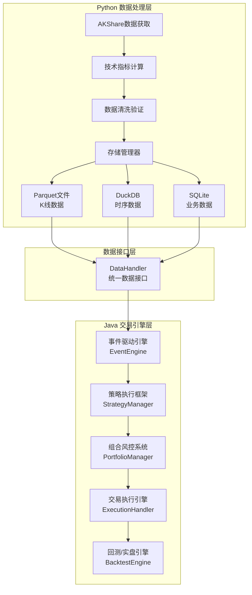

# QuantCapital 混合量化交易系统

[](https://www.oracle.com/java/)
[](https://www.python.org/)
[](https://spring.io/projects/spring-boot)
[](LICENSE)

专为A股市场设计的高性能量化交易系统，采用Python+Java混合架构，充分发挥两种语言的优势。

## 🎯 项目概述

### 架构特点

- **Python端**：数据获取与处理（AKShare、技术指标计算、多格式存储）
- **Java端**：高性能事件驱动交易引擎（虚拟线程、低延迟、高吞吐）
- **混合架构**：进程分离，数据一致性，回测与实盘统一

### 核心优势

- ⚡ **高性能**：Java端基于JDK 21虚拟线程，ZGC垃圾收集器，支持万级TPS
- 🔄 **事件驱动**：异步处理架构，故障隔离，<1ms延迟响应  
- 📊 **数据兼容**：完美读取Python生成的Parquet、DuckDB、SQLite数据
- 🧠 **智能策略**：支持开单、止盈止损、通用强制止损策略
- 🛡️ **风控完善**：多层次实时风控，智能仓位管理
- 🔧 **配置灵活**：支持回测/实盘环境切换，参数热更新

## 📦 项目结构

```
quant-trading/
├── python/                         # Python数据处理模块
│   ├── quantcapital/               # 核心Python库
│   │   ├── backtest/               # 回测引擎
│   │   ├── config/                 # 配置管理
│   │   ├── data/                   # 数据处理
│   │   ├── engine/                 # 事件引擎
│   │   ├── entities/               # 实体定义
│   │   ├── execution/              # 执行引擎
│   │   ├── portfolio/              # 组合管理
│   │   └── strategy/               # 策略基类
│   └── examples/                   # Python示例
├── src/                            # Java交易引擎
│   ├── main/java/com/quantcapital/
│   │   ├── config/                 # 配置类
│   │   ├── entities/               # 实体模型
│   │   ├── engine/                 # 事件引擎
│   │   ├── interfaces/             # 核心接口
│   │   ├── strategy/               # 策略框架
│   │   └── utils/                  # 工具类
│   └── test/                       # 测试代码
├── examples/
│   ├── python/                     # Python使用示例
│   └── java/                       # Java使用示例
├── docs/                           # 文档目录
│   ├── 用户手册.md                 # 完整使用手册
│   └── 开发者指南.md               # 开发技术指南
├── requirements.txt                # Python依赖
├── pom.xml                        # Java Maven配置
└── java_migration_guide.md        # 架构迁移指南
```

## 🚀 快速开始

### 1. 环境要求

#### 系统要求

- **Java 21+**（必须支持虚拟线程）
- **Python 3.11+**
- **Maven 3.9+**
- **内存**：建议8GB以上
- **存储**：10GB以上

#### 依赖安装

```bash
# 1. 克隆项目
git clone <repository-url>
cd quant-trading

# 2. 安装Python依赖
pip install -r requirements.txt

# 3. 验证环境
python -c "import akshare, pandas, numpy; print('Python环境就绪')"
java -version  # 确保显示21或更高版本
```

### 2. 数据准备（Python端）

```bash
# 进入Python模块目录
cd python

# 获取股票历史数据
python examples/quick_start.py

# 验证数据文件生成
ls -la .data/  # 应该看到parquet文件和数据库文件
```

### 3. 启动交易引擎（Java端）

```bash
# 返回项目根目录
cd ..

# 编译项目
mvn clean compile

# 运行测试
mvn test

# 启动回测模式
mvn spring-boot:run -Dspring.profiles.active=backtest

# 启动实盘模式
mvn spring-boot:run -Dspring.profiles.active=live
```

## 🏗️ 系统架构

### 混合架构设计



### 技术栈

#### Python端

- **数据获取**: AKShare
- **数据处理**: pandas, numpy, talib
- **存储**: Parquet, DuckDB, SQLite
- **并发**: asyncio, threading

#### Java端

- **核心框架**: Spring Boot 3, JDK 21
- **数据处理**: Tablesaw, Apache Arrow, Apache Parquet
- **数据库**: DuckDB JDBC, SQLite JDBC
- **并发**: 虚拟线程, BlockingQueue
- **工具库**: Lombok, Guava, Jackson
- **测试**: JUnit 5, Mockito, AssertJ

## 📊 核心功能

### 事件驱动引擎

- **优先级队列**：重要事件优先处理
- **虚拟线程**：高并发低延迟处理
- **异步处理**：避免阻塞，故障隔离
- **背压处理**：防止内存溢出
- **性能监控**：实时统计处理速度和延迟

### 策略框架

支持三种策略类型：

1. **开单策略（Entry Strategy）**：寻找开仓机会
2. **平仓策略（Exit Strategy）**：管理已有持仓，止盈止损
3. **通用强制止损**：兜底风控，风险控制

### 风险管理

- **仓位控制**：单标的≤X%，总仓位≤Y%
- **资金管理**：可用资金检查，冻结资金管理
- **风险监控**：日内亏损限制，最大回撤控制
- **合规检查**：ST股票限制，新股风险检查

### 数据处理

- **多格式支持**：Parquet（K线）、DuckDB（指标）、SQLite（业务）
- **列式存储**：高效的数据读取和查询
- **增量更新**：支持实时数据更新
- **数据验证**：完整性检查和异常处理

## 📈 使用示例

### Python数据获取

```python
import akshare as ak
from quantcapital.data.data_manager import DataManager

# 初始化数据管理器
dm = DataManager()

# 获取股票列表并下载数据
stock_list = ak.stock_zh_a_spot_em()
for symbol in stock_list['代码'][:100]:
    data = ak.stock_zh_a_hist(symbol=symbol, period="daily", start_date="20230101", end_date="20241201")
    dm.save_stock_data(symbol, data)
```

### Java策略开发

```java
@Component
public class MACrossStrategy extends BaseStrategy {
    
    private final int shortWindow = 10;
    private final int longWindow = 30;
    
    @Override
    public void onBar(Bar bar) {
        // 获取技术指标
        double shortMa = getIndicator(bar.getSymbol(), "MA", shortWindow);
        double longMa = getIndicator(bar.getSymbol(), "MA", longWindow);
        
        Position position = getPosition(bar.getSymbol());
        
        // 金叉买入信号
        if (shortMa > longMa && position.getQuantity() == 0) {
            sendSignal(bar.getSymbol(), SignalType.LONG, 0.8, "均线金叉买入信号");
        }
        // 死叉卖出信号
        else if (shortMa < longMa && position.getQuantity() > 0) {
            sendSignal(bar.getSymbol(), SignalType.SHORT, 0.8, "均线死叉卖出信号");
        }
    }
}
```

### 回测配置

```yaml
quantcapital:
  backtest:
    start-date: "2023-01-01"
    end-date: "2024-01-01"
    initial-capital: 1000000.0
    universe: ["000001.SZ", "000002.SZ", "600000.SH"]
  
  execution:
    slippage: 0.001              # 滑点 0.1%
    commission-rate: 0.0003      # 手续费 0.03%
  
  risk:
    max-position-pct: 0.05       # 单标的最大仓位5%
    max-total-position-pct: 0.95 # 总仓位上限95%
```

## 📊 性能指标

### TODO 系统性能

- **事件处理速度**：>10,000 TPS
- **处理延迟**：<1ms（P99）
- **内存使用**：<4GB（正常运行）
- **GC停顿时间**：<10ms（ZGC）

### TODO 回测性能

基于2024年全年A股数据（3000+股票）：

- **数据加载**：xxx只股票/分钟
- **策略执行**：xxxx次信号生成/秒
- **风控检查**：xxxxx次/秒
- **内存峰值**：6GB

## 📖 文档指南

### 用户文档

- **[用户手册](docs/用户手册.md)**：完整的使用指南，包含安装、配置、策略开发
- **[Python示例](examples/python/)**：数据获取和处理示例
- **[Java示例](examples/java/)**：策略开发和回测示例

### 开发者文档

- **[开发者指南](docs/开发者指南.md)**：架构设计、核心组件、开发规范

## 🔧 开发环境

### IDE推荐配置

#### IntelliJ IDEA

```bash
# JVM选项
-Xmx8g -XX:+UseZGC --enable-preview

# 编译器设置
Java Compiler -> Project bytecode version: 21
Java Compiler -> Use '--enable-preview'
```

#### VS Code / Cursor

```json
{
  "java.compile.nullAnalysis.mode": "automatic",
  "java.configuration.runtimes": [
    {
      "name": "JavaSE-21",
      "path": "/path/to/jdk21"
    }
  ]
}
```

### 调试与监控

#### 本地开发

```bash
# 启动调试模式
mvn spring-boot:run -Dspring-boot.run.jvmArguments="-Xdebug -Xrunjdwp:transport=dt_socket,server=y,suspend=n,address=5005"

# 监控端点
http://localhost:8080/actuator/health    # 健康检查
http://localhost:8080/actuator/metrics   # 性能指标
http://localhost:8080/actuator/info      # 应用信息
```

#### 生产环境

```bash
# JFR性能分析
java -XX:+FlightRecorder -XX:StartFlightRecording=duration=60s,filename=app.jfr -jar app.jar

# GC日志
java -Xlog:gc*:gc.log -jar app.jar
```

## 🤝 贡献指南

### 开发流程

1. **Fork项目**并创建功能分支
2. **编写代码**，遵循项目编码规范
3. **添加测试**，确保测试覆盖率
4. **提交PR**，描述变更内容
5. **代码审查**，修复反馈问题

### 代码规范

- **Java**: 遵循Google Java Style Guide
- **Python**: 遵循PEP8规范
- **提交信息**: 遵循Conventional Commits规范

### 测试要求

- 新功能必须有对应的单元测试
- 核心组件变更需要集成测试
- 性能相关变更需要基准测试

## 📄 许可证

本项目基于MIT许可证开源 - 查看 [LICENSE](LICENSE) 文件了解详情。

## ⚠️ 免责声明

本系统仅用于学习和研究目的。实盘交易有风险，投资需谨慎。使用者应充分评估风险，后果自负。请确保遵守当地金融法规。
