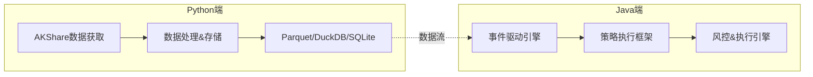

# QuantCapital 混合量化交易系统

专为A股市场设计的高性能量化交易系统，采用Python+Java混合架构，充分发挥两种语言的优势。

## 🚀 快速开始

### 环境要求
- **Java 24+**
- **Python 3.13+**
- **Maven 3.9.11+**

### 30秒启动

```bash
# 1. 安装依赖
pip install -r requirements.txt

# 2. 数据准备
cd python && python examples/quick_start.py

# 3. 启动引擎
cd .. && mvn spring-boot:run -Dspring.profiles.active=backtest
```

完整安装和配置请参考：📖 **[用户手册](docs/用户手册.md)**

## 📁 项目结构

```
quant-trading/
├── 📂 python/quantcapital/        # Python数据处理模块
├── 📂 src/main/java/              # Java交易引擎
├── 📂 examples/                   # 使用示例
├── 📂 docs/                       # 详细文档
│   ├── 📄 用户手册.md             # 完整使用指南
│   └── 📄 系统设计文档.md         # 架构设计与技术选型
├── 📄 requirements.txt           # Python依赖
└── 📄 pom.xml                   # Java依赖
```

## 📚 文档导航

### 👥 用户文档
- **[📖 用户手册](docs/用户手册.md)** - 完整的安装、配置、使用指南
  - 环境搭建 & 快速启动
  - 配置说明 & 参数调优
  - 策略开发 & 回测流程
  - 风险管理 & 监控面板
  - 常见问题 & 故障排除

### 🔧 开发者文档
- **[📋 系统设计文档](docs/系统设计文档.md)** - 深入的架构设计与技术选型
  - 混合架构设计理念
  - 事件驱动引擎架构
  - 核心模块设计思路
  - 技术选型与实现
  - 扩展性设计
  - 监控与可观测性

### 🌟 示例代码
- **[Python示例](examples/python/)** - 数据获取和处理示例
- **[Java示例](examples/java/)** - 策略开发和回测示例

## 🏗️ 架构概览



**职责分工**：
- **Python端**：数据获取、清洗、技术指标计算、多格式存储、生成报告
- **Java端**：高性能事件处理、策略执行、风控管理、回测/实盘引擎

详细架构设计请参考：🔧 **[系统设计文档](docs/系统设计文档.md)**

## ⚡ 性能亮点

- **事件处理**：>10,000 TPS，<1ms延迟（P99）
- **并发能力**：支持1000+策略并发运行
- **内存管理**：ZGC垃圾收集器，停顿时间<10ms
- **数据处理**：列式存储，高效查询和计算

## 🔨 开发环境

### IDE推荐配置

#### IntelliJ IDEA
```bash
# JVM选项
-Xmx8g -XX:+UseZGC --enable-preview
```

### 运行模式

```bash
# 回测模式
mvn spring-boot:run -Dspring.profiles.active=backtest

# 实盘模式  
mvn spring-boot:run -Dspring.profiles.active=live

# 调试模式
mvn spring-boot:run -Dspring-boot.run.jvmArguments="-Xdebug -Xrunjdwp:transport=dt_socket,server=y,suspend=n,address=5005"
```
