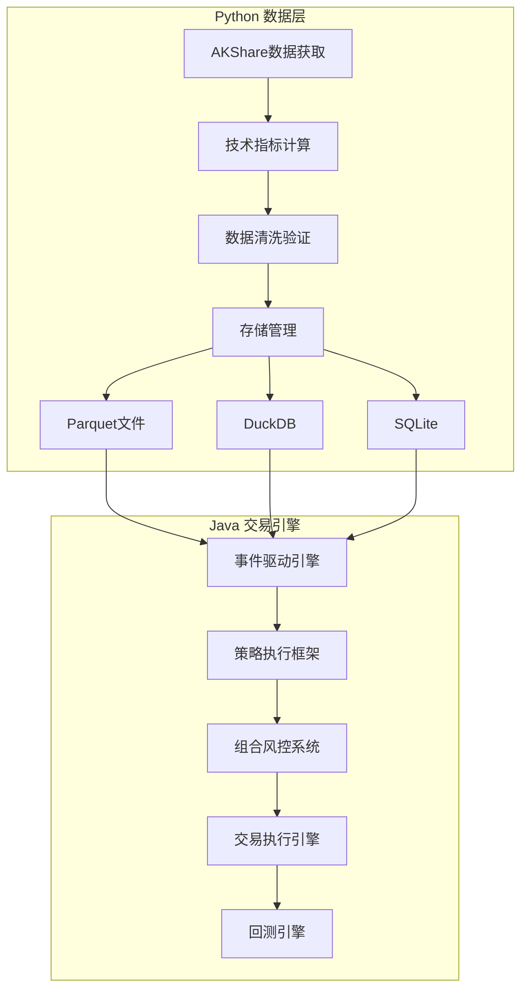

# QuantCapital Java交易引擎 - 开发者指南

## 🏗️ 项目架构

### 混合架构设计

本项目采用Python+Java混合架构，充分发挥两种语言的优势：



### 技术栈

#### Java端技术栈
- **核心**: Spring Boot 3, JDK 21, Maven
- **数据处理**: Tablesaw, Apache Arrow, Apache Parquet
- **数据库**: DuckDB JDBC, SQLite JDBC
- **并发**: 虚拟线程, BlockingQueue, ThreadPool
- **序列化**: Jackson
- **工具**: Lombok, Guava, Commons Lang
- **测试**: JUnit 5, Mockito, AssertJ
- **监控**: Spring Actuator

#### 性能优化技术
- **ZGC垃圾收集器**: 低延迟GC，停顿时间<10ms
- **虚拟线程**: Project Loom，轻量级并发
- **Apache Arrow**: 内存列式存储，高效数据交换
- **DuckDB**: 内存分析数据库，列式查询优化

## 📦 模块结构

```
src/main/java/com/quantcapital/
├── entities/           # 核心实体类
│   ├── Event.java     # 事件基类
│   ├── Bar.java       # K线数据
│   ├── Signal.java    # 交易信号
│   ├── Order.java     # 订单
│   └── Fill.java      # 成交
├── engine/            # 事件驱动引擎
│   ├── EventEngine.java
│   └── EventHandler.java
├── data/              # 数据访问层
│   └── DataHandler.java
├── strategy/          # 策略框架
│   └── BaseStrategy.java
├── portfolio/         # 组合风控
├── execution/         # 执行引擎
├── backtest/          # 回测引擎
└── config/            # 配置管理
```

## 🔧 核心组件详解

### 1. 事件驱动引擎

#### 设计原理
```java
/**
 * 高性能事件分发系统特性：
 * 1. 优先级队列：重要事件优先处理
 * 2. 虚拟线程：高并发低延迟
 * 3. 异步处理：避免阻塞
 * 4. 故障隔离：单处理器异常不影响整体
 * 5. 背压处理：防止内存溢出
 */
@Component
public class EventEngine {
    // 优先级队列，按事件优先级排序
    private PriorityBlockingQueue<Event> eventQueue;
    
    // 虚拟线程执行器
    private ExecutorService executorService = 
        Executors.newVirtualThreadPerTaskExecutor();
}
```

#### 事件处理流程
```java
// 1. 事件发布
boolean published = eventEngine.publishEvent(marketEvent);

// 2. 优先级分发
dispatchEvent(event) {
    List<EventHandler> handlers = getHandlers(event.getType());
    
    // 3. 并行处理（虚拟线程）
    for (EventHandler handler : handlers) {
        executorService.submit(() -> {
            handler.handleEvent(event);
        });
    }
}
```

### 2. 数据访问层

#### 统一数据接口
```java
public interface DataHandler {
    // K线数据访问 (OLAP)
    Table getBars(List<String> symbols, LocalDate start, LocalDate end, Frequency freq);
    Bar getLatestBar(String symbol, Frequency frequency);
    
    // 业务数据访问 (OLTP)
    List<String> getUniverse(LocalDate date);
    boolean isTradingDay(LocalDate date);
    Map<String, Object> getStockInfo(String symbol);
}
```

#### 数据存储层级
```java
/**
 * 分层存储架构：
 * 
 * 应用层 ←→ DuckDB(内存查询) ←→ Parquet(长期存档)
 *               ↓
 *           SQLite(业务数据)
 */
public class BacktestDataHandler implements DataHandler {
    
    private Connection duckdbConnection;  // 内存分析数据库
    private Connection sqliteConnection;  // 业务数据库
    
    @Override
    public Table getBars(List<String> symbols, LocalDate start, LocalDate end, Frequency freq) {
        // 1. 从DuckDB查询（优先）
        String sql = """
            SELECT * FROM read_parquet('data/kline/frequency=%s/*.parquet')
            WHERE symbol IN (%s) AND date BETWEEN ? AND ?
            ORDER BY symbol, datetime
            """.formatted(freq.getCode(), joinSymbols(symbols));
            
        return Table.read().db(duckdbConnection, sql, start, end);
    }
}
```

### 3. 策略框架

#### 策略分类与职责
```java
public enum StrategyType {
    ENTRY,           // 开单策略：寻找开仓机会
    EXIT,            // 止盈止损策略：管理已有持仓  
    UNIVERSAL_STOP   // 通用强制止损：兜底风控
}

public interface BaseStrategy extends EventHandler {
    List<String> getWatchSymbols();  // 动态关注标的
    List<Signal> onMarketEvent(MarketEvent event);  // 核心策略逻辑
    void onFillEvent(FillEvent event);  // 持仓状态更新
}
```

#### 策略运行架构
```java
@Component
public class StrategyManager {
    
    public void initializeStrategies() {
        for (BaseStrategy strategy : strategies) {
            // 根据策略类型注册不同事件
            if (strategy.getStrategyType() == StrategyType.ENTRY) {
                // 开单策略关注全市场 - 已持有标的
                eventEngine.registerHandler("MARKET", strategy);
            } else if (strategy.getStrategyType() == StrategyType.EXIT) {
                // 止盈止损策略仅关注持仓标的
                eventEngine.registerHandler("MARKET", strategy);
                eventEngine.registerHandler("FILL", strategy);
            }
        }
    }
}
```

### 4. 组合风控系统

#### 信号处理与风控
```java
@Component
public class PortfolioRiskManager implements EventHandler {
    
    @Override
    public void handleEvent(Event event) {
        if (event instanceof SignalEvent signalEvent) {
            processSignal(signalEvent.getSignal());
        } else if (event instanceof FillEvent fillEvent) {
            updatePositions(fillEvent.getFill());
        }
    }
    
    private void processSignal(Signal signal) {
        // 1. 信号去重和冲突解决
        if (isDuplicateSignal(signal)) return;
        
        // 2. 风控检查
        if (!passRiskCheck(signal)) return;
        
        // 3. 资金分配
        double positionSize = calculatePositionSize(signal);
        
        // 4. 生成订单
        Order order = signalToOrder(signal, positionSize);
        
        // 5. 发布订单事件
        OrderEvent orderEvent = new OrderEvent(LocalDateTime.now(), order, OrderAction.NEW);
        eventEngine.publishEvent(orderEvent);
    }
}
```

#### 风控检查规则
```java
private boolean passRiskCheck(Signal signal) {
    // 1. 仓位限制检查
    if (getPositionPercent(signal.getSymbol()) + getNewPositionPercent(signal) 
        > maxPositionPercent) {
        log.warn("超出单标的仓位限制: {}", signal.getSymbol());
        return false;
    }
    
    // 2. 总仓位检查
    if (getTotalPositionPercent() + getNewPositionPercent(signal) 
        > maxTotalPositionPercent) {
        log.warn("超出总仓位限制");
        return false;
    }
    
    // 3. 资金充足性检查
    if (getAvailableCash() < calculateOrderValue(signal)) {
        log.warn("可用资金不足");
        return false;
    }
    
    // 4. 合规性检查
    if (isStockRestricted(signal.getSymbol())) {
        log.warn("标的受限: {}", signal.getSymbol());
        return false;
    }
    
    return true;
}
```

### 5. 执行引擎

#### 回测执行器
```java
@Component
public class SimulatedExecutionHandler implements ExecutionHandler {
    
    @Override
    public void executeOrder(Order order) {
        // 1. 延迟模拟
        simulateDelay(executionConfig.getDelayMs());
        
        // 2. 滑点计算
        double executionPrice = calculateExecutionPrice(order);
        
        // 3. 生成成交
        Fill fill = new Fill(
            order.getOrderId(),
            order.getSymbol(),
            order.getSide(),
            order.getQuantity(),
            executionPrice,
            LocalDateTime.now(),
            order.getStrategyId()
        );
        
        // 4. 手续费计算
        fill.calculateFeesWithCustomRates(
            executionConfig.getCommissionRate(),
            0.001,  // 印花税
            0.00002, // 过户费
            5.0     // 最低手续费
        );
        
        // 5. 发布成交事件
        FillEvent fillEvent = new FillEvent(LocalDateTime.now(), fill);
        eventEngine.publishEvent(fillEvent);
    }
}
```

## 🧪 测试框架

### 单元测试规范

#### 1. 测试命名规范
```java
@Test
void should_PublishAndHandleEvent_When_EventEngineIsRunning() {
    // Given - 给定条件
    // When - 执行操作  
    // Then - 验证结果
}
```

#### 2. 事件引擎测试
```java
@SpringBootTest
class EventEngineTest {
    
    @Test
    void testEventPriority() throws InterruptedException {
        // 测试优先级队列是否按优先级处理事件
        CountDownLatch latch = new CountDownLatch(3);
        AtomicInteger processOrder = new AtomicInteger(0);
        
        // 创建不同优先级事件
        TimerEvent highPriorityEvent = new TimerEvent(now(), MARKET_DATA_UPDATE, 1000);
        TimerEvent lowPriorityEvent = new TimerEvent(now(), CLEANUP, 1000);
        
        // 验证高优先级事件先被处理
        // ...
    }
}
```

#### 3. 策略测试模板
```java
@ExtendWith(MockitoExtension.class)
class StrategyTest {
    
    @Mock
    private EventEngine eventEngine;
    
    @Mock
    private DataHandler dataHandler;
    
    @InjectMocks
    private MACrossStrategy strategy;
    
    @Test
    void should_GenerateBuySignal_When_GoldenCross() {
        // 构造测试数据
        Bar bar = createTestBar("000001.SZ", 10.0, 10.5, 9.5, 10.2);
        bar.setMa5(10.3);  // MA5 > MA20
        bar.setMa20(10.1);
        
        MarketEvent event = new MarketEvent(LocalDateTime.now(), bar, Frequency.DAILY);
        
        // 执行策略
        List<Signal> signals = strategy.onMarketEvent(event);
        
        // 验证结果
        assertThat(signals).hasSize(1);
        assertThat(signals.get(0).getDirection()).isEqualTo(SignalDirection.BUY);
    }
}
```

### 集成测试

#### 端到端回测测试
```java
@SpringBootTest
@TestPropertySource(properties = {
    "quantcapital.mode=backtest",
    "quantcapital.data.root-path=src/test/resources/test-data"
})
class BacktestIntegrationTest {
    
    @Test
    void should_CompleteBacktest_When_ValidConfiguration() {
        // 配置回测参数
        BacktestConfig config = BacktestConfig.builder()
            .startDate("2023-01-01")
            .endDate("2023-01-31") 
            .universe(List.of("000001.SZ"))
            .initialCapital(100000.0)
            .build();
        
        // 执行回测
        BacktestEngine engine = new BacktestEngine(config);
        BacktestResult result = engine.run();
        
        // 验证结果
        assertThat(result.getFinalCapital()).isGreaterThan(0);
        assertThat(result.getTotalTrades()).isGreaterThan(0);
        assertThat(result.getMaxDrawdown()).isLessThan(0.5); // 最大回撤<50%
    }
}
```

## 🚀 性能优化

### JVM调优

#### 启动参数
```bash
# 生产环境推荐配置
java -XX:+UseZGC \                          # 使用ZGC低延迟GC
     -XX:+UnlockExperimentalVMOptions \     # 解锁实验性功能
     -Xmx8g \                               # 最大堆内存
     -XX:+FlightRecorder \                  # 启用JFR性能分析
     -XX:+UseTransparentHugePages \         # 启用大页内存
     --enable-preview \                     # 启用预览功能（虚拟线程）
     -jar quant-trading-java.jar
```

#### 内存配置
```yaml
# application-prod.yml
quantcapital:
  engine:
    queue-capacity: 50000      # 增大队列容量
    worker-threads: 8          # 根据CPU核心数调整
    batch-size: 500           # 增大批处理大小
  
  data:
    preload-days: 200         # 预加载更多历史数据
```

### 并发优化

#### 虚拟线程使用
```java
// 传统线程池 vs 虚拟线程
// 传统方式（不推荐）
ExecutorService oldExecutor = Executors.newFixedThreadPool(100);

// 虚拟线程方式（推荐）
ExecutorService virtualExecutor = Executors.newVirtualThreadPerTaskExecutor();

// 处理大量并发任务
for (int i = 0; i < 10000; i++) {
    virtualExecutor.submit(() -> {
        // 处理任务（可以是IO密集型）
        processMarketData();
    });
}
```

#### 事件处理优化
```java
@Component
public class OptimizedEventEngine {
    
    // 使用多个队列减少竞争
    private final List<PriorityBlockingQueue<Event>> eventQueues;
    
    public void publishEvent(Event event) {
        // 根据事件类型分发到不同队列
        int queueIndex = getQueueIndex(event);
        eventQueues.get(queueIndex).offer(event);
    }
    
    private int getQueueIndex(Event event) {
        // 使用哈希分区减少竞争
        return Math.abs(event.getSymbol().hashCode()) % eventQueues.size();
    }
}
```

### 数据访问优化

#### 缓存策略
```java
@Component
public class CachedDataHandler implements DataHandler {
    
    // 使用Caffeine缓存热点数据
    private final Cache<String, Bar> latestBarCache = Caffeine.newBuilder()
        .maximumSize(10000)
        .expireAfterWrite(5, TimeUnit.MINUTES)
        .build();
    
    @Override
    public Bar getLatestBar(String symbol, Frequency frequency) {
        String cacheKey = symbol + ":" + frequency;
        return latestBarCache.get(cacheKey, key -> loadFromDatabase(symbol, frequency));
    }
}
```

## 📊 监控和指标

### 关键性能指标

```java
@Component
public class MetricsCollector {
    
    private final MeterRegistry meterRegistry;
    
    // 事件处理延迟
    private final Timer eventProcessingTimer;
    
    // 策略执行计数
    private final Counter strategyExecutionCounter;
    
    // 订单处理速率
    private final Gauge orderProcessingRate;
    
    public void recordEventProcessing(String eventType, Duration duration) {
        eventProcessingTimer.record(duration);
    }
}
```

### 监控端点
```java
@RestController
@RequestMapping("/api/monitoring")
public class MonitoringController {
    
    @GetMapping("/engine/stats")
    public Map<String, Object> getEngineStatistics() {
        return Map.of(
            "queueSize", eventEngine.getQueueSize(),
            "processedEvents", eventEngine.getProcessedCount(),
            "eventsPerSecond", eventEngine.getEventsPerSecond(),
            "avgProcessingTime", eventEngine.getAvgProcessingTime()
        );
    }
    
    @GetMapping("/strategies/performance")
    public List<StrategyPerformance> getStrategyPerformance() {
        return strategyManager.getAllStrategies().stream()
            .map(this::buildPerformanceMetrics)
            .collect(Collectors.toList());
    }
}
```

## 🔧 开发规范

### 代码风格

#### 1. 命名规范
```java
// 类名：大驼峰，含义明确
public class MarketDataProcessor

// 方法名：小驼峰，动词开头
public void processMarketEvent()
public boolean isValidSignal()
public List<Order> generateOrders()

// 常量：全大写，下划线分隔
public static final int MAX_POSITION_SIZE = 10000;
public static final String DEFAULT_STRATEGY_ID = "default_strategy";

// 枚举：大驼峰
public enum OrderStatus { PENDING, FILLED, CANCELLED }
```

#### 2. 注释规范
```java
/**
 * 处理市场数据事件，生成交易信号
 * 
 * @param marketEvent 市场数据事件，包含最新的K线数据
 * @return 生成的信号列表，可能为空
 * @throws StrategyException 当策略执行出现异常时
 */
public List<Signal> processMarketEvent(MarketEvent marketEvent) throws StrategyException {
    // 1. 验证输入参数
    if (marketEvent == null || marketEvent.getBar() == null) {
        log.warn("接收到无效的市场事件");
        return Collections.emptyList();
    }
    
    // 2. 执行策略逻辑
    Bar currentBar = marketEvent.getBar();
    List<Signal> signals = new ArrayList<>();
    
    // TODO: 实现具体的策略逻辑
    
    return signals;
}
```

#### 3. 异常处理
```java
public class StrategyException extends Exception {
    public StrategyException(String message, Throwable cause) {
        super(message, cause);
    }
}

// 异常处理示例
try {
    List<Signal> signals = strategy.processMarketEvent(event);
    signalProcessor.processSignals(signals);
} catch (StrategyException e) {
    log.error("策略执行失败: 策略ID={}, 错误={}", strategy.getStrategyId(), e.getMessage(), e);
    metricsCollector.recordStrategyError(strategy.getStrategyId());
} catch (Exception e) {
    log.error("未预期的策略异常: 策略ID={}", strategy.getStrategyId(), e);
    // 发送告警
    alertService.sendAlert("策略执行异常", e);
}
```

### Git提交规范

```bash
# 提交格式
<type>(<scope>): <subject>

# 类型说明
feat:     新功能
fix:      修复Bug
docs:     文档更新
style:    代码格式调整
refactor: 重构
test:     测试相关
chore:    构建/工具链

# 示例
feat(engine): 添加事件优先级队列支持
fix(strategy): 修复均线交叉策略的金叉检测逻辑
docs(api): 更新策略开发API文档
test(portfolio): 添加风控模块单元测试
```

## 🔍 故障排查

### 常见问题排查

#### 1. 事件处理延迟
```java
// 检查点1：事件队列大小
int queueSize = eventEngine.getQueueSize();
if (queueSize > 1000) {
    log.warn("事件队列堆积，当前大小: {}", queueSize);
    // 可能原因：处理器性能瓶颈、资源不足
}

// 检查点2：处理器性能
Map<String, Double> processingTimes = eventEngine.getHandlerProcessingTimes();
processingTimes.forEach((handler, avgTime) -> {
    if (avgTime > 100) { // 超过100ms
        log.warn("处理器性能异常: handler={}, avgTime={}ms", handler, avgTime);
    }
});
```

#### 2. 内存泄漏排查
```bash
# 使用JFR分析内存使用
java -XX:+FlightRecorder \
     -XX:StartFlightRecording=duration=60s,filename=memory-analysis.jfr \
     -jar trading-engine.jar

# 分析GC日志
-XX:+UseZGC -XX:+PrintGC -XX:+PrintGCDetails
```

#### 3. 数据访问问题
```java
// 数据连接检查
@Component
public class DataHealthChecker {
    
    @EventListener
    @Scheduled(fixedRate = 60000) // 每分钟检查
    public void checkDataConnections() {
        try {
            // 检查DuckDB连接
            duckdbConnection.createStatement()
                .executeQuery("SELECT 1").close();
            
            // 检查数据完整性
            LocalDate today = LocalDate.now();
            List<String> symbols = dataHandler.getUniverse(today);
            if (symbols.isEmpty()) {
                alertService.sendAlert("股票池数据为空", today.toString());
            }
            
        } catch (SQLException e) {
            log.error("数据连接检查失败", e);
            alertService.sendAlert("数据连接异常", e.getMessage());
        }
    }
}
```

## 📝 AI Coder (Cursor) 开发提示

### 项目上下文
当您使用Cursor开发此项目时，请了解以下上下文：

1. **架构理念**: 这是一个事件驱动的混合架构系统，Java负责高性能交易逻辑，Python负责数据获取
2. **性能导向**: 所有设计都以低延迟、高吞吐为目标，使用虚拟线程和ZGC
3. **数据一致性**: Java端只读取Python生成的数据，不修改数据源
4. **模块化**: 每个模块职责单一，通过事件进行通信

### 开发指导原则

1. **优先使用现有组件**: 先检查是否有现成的接口或基类可以继承
2. **保持事件驱动**: 模块间通信必须通过事件，避免直接调用
3. **异常安全**: 所有异常都要妥善处理，不能影响事件引擎运行
4. **性能意识**: 避免阻塞操作，优先使用异步处理
5. **测试驱动**: 新功能必须有对应的单元测试

### 常用代码模板

#### 新建策略模板
```java
@Component
public class NewStrategy implements BaseStrategy {
    
    private static final String STRATEGY_ID = "new_strategy";
    private final EventEngine eventEngine;
    private StrategyStatus status = StrategyStatus.NOT_INITIALIZED;
    
    @Override
    public List<Signal> onMarketEvent(MarketEvent event) {
        // 实现策略逻辑
        return List.of();
    }
    
    // 实现其他必须的方法...
}
```

#### 新建事件处理器模板
```java
@Component
public class NewEventHandler implements EventHandler {
    
    @Override
    public String getName() {
        return "NewEventHandler";
    }
    
    @Override
    public void handleEvent(Event event) {
        try {
            // 处理逻辑
        } catch (Exception e) {
            log.error("事件处理失败: {}", event, e);
        }
    }
}
```

---

> **开发团队**: 保持代码简洁、性能优先、文档完善的原则，构建高质量的量化交易系统。