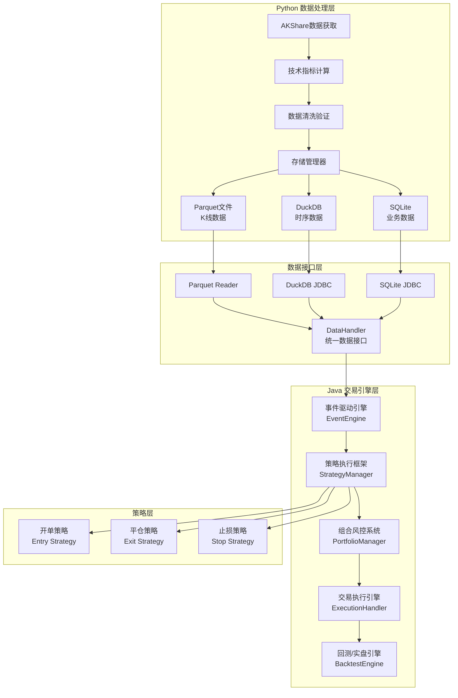

# QuantCapital 混合量化交易系统 - 开发者指南

## 🏗️ 系统架构

### 混合架构设计原则

本项目采用Python+Java混合架构，基于以下设计原则：

1. **模块化设计**：各模块职责清晰，低耦合高内聚
2. **事件驱动**：通过事件总线实现模块间通信，异步处理
3. **进程分离**：数据获取进程与交易引擎进程独立运行
4. **一致性保证**：回测与实盘共享核心代码，确保策略一致性
5. **高性能优化**：Java端采用虚拟线程、列式存储等技术
6. **可插拔组件**：策略、数据源、执行器支持插件机制

### 系统架构图



### 技术栈

#### Python端技术栈
- **数据获取**: AKShare, tushare
- **数据处理**: pandas, numpy, talib
- **存储**: Parquet, DuckDB, SQLite
- **并发**: asyncio, threading
- **配置**: pydantic, yaml

#### Java端技术栈
- **核心框架**: Spring Boot 3, JDK 21, Maven
- **数据处理**: Tablesaw, Apache Arrow, Apache Parquet
- **数据库**: DuckDB JDBC, SQLite JDBC
- **并发**: 虚拟线程, BlockingQueue, ExecutorService
- **序列化**: Jackson
- **工具库**: Lombok, Guava, Commons Lang
- **测试**: JUnit 5, Mockito, AssertJ
- **监控**: Spring Actuator

#### 性能优化技术
- **ZGC垃圾收集器**: 低延迟GC，停顿时间<10ms
- **虚拟线程**: Project Loom，轻量级并发
- **Apache Arrow**: 内存列式存储，高效数据交换
- **DuckDB**: 内存分析数据库，列式查询优化

## 📦 项目结构

```
quant-trading/
├── python/                          # Python数据处理模块
│   ├── quantcapital/               # 核心Python库
│   │   ├── __init__.py
│   │   ├── backtest/               # 回测引擎
│   │   ├── config/                 # 配置管理
│   │   ├── data/                   # 数据处理
│   │   ├── engine/                 # 事件引擎
│   │   ├── entities/               # 实体定义
│   │   ├── execution/              # 执行引擎
│   │   ├── portfolio/              # 组合管理
│   │   └── strategy/               # 策略基类
│   └── examples/                   # Python示例
├── src/                            # Java交易引擎
│   ├── main/
│   │   ├── java/com/quantcapital/
│   │   │   ├── QuantCapitalApplication.java  # 主应用
│   │   │   ├── config/             # 配置类
│   │   │   ├── entities/           # 实体模型
│   │   │   ├── engine/             # 事件引擎
│   │   │   ├── interfaces/         # 核心接口
│   │   │   ├── strategy/           # 策略框架
│   │   │   └── utils/              # 工具类
│   │   └── resources/
│   │       ├── application.yml     # 主配置文件
│   │       └── logback-spring.xml  # 日志配置
│   └── test/                       # 测试代码
├── examples/
│   ├── python/                     # Python示例
│   └── java/                       # Java示例
├── docs/                           # 文档目录
│   ├── 用户手册.md                 # 用户使用手册
│   └── 开发者指南.md               # 本文件
├── requirements.txt                # Python依赖
├── pom.xml                        # Maven配置
├── java_migration_guide.md        # 迁移指南
└── README.md                      # 项目说明
```

## 🔧 核心组件详解

### 1. 事件驱动引擎 (EventEngine)

```java
@Component
public class EventEngine {
    
    // 优先级队列，支持事件优先级处理
    private final BlockingQueue<Event> eventQueue = new PriorityBlockingQueue<>();
    
    // 虚拟线程执行器，高并发低延迟
    private final ExecutorService eventProcessor = Executors.newVirtualThreadPerTaskExecutor();
    
    // 事件处理器注册表
    private final Map<Class<? extends Event>, List<EventHandler>> handlers = new ConcurrentHashMap<>();
    
    /**
     * 发布事件到队列
     */
    public void publish(Event event) {
        event.setTimestamp(System.nanoTime());  // 纳秒级时间戳
        boolean success = eventQueue.offer(event);
        if (!success) {
            // 队列满时的背压处理
            handleBackpressure(event);
        }
        eventMetrics.incrementPublished();
    }
    
    /**
     * 异步处理事件
     */
    private void processEvents() {
        while (running.get()) {
            try {
                Event event = eventQueue.take();  // 阻塞获取
                eventProcessor.submit(() -> handleEvent(event));
            } catch (InterruptedException e) {
                Thread.currentThread().interrupt();
                break;
            }
        }
    }
    
    /**
     * 分发事件到对应处理器
     */
    private void handleEvent(Event event) {
        List<EventHandler> eventHandlers = handlers.get(event.getClass());
        if (eventHandlers != null) {
            for (EventHandler handler : eventHandlers) {
                try {
                    handler.handle(event);
                } catch (Exception e) {
                    logger.error("事件处理失败", e);
                    eventMetrics.incrementFailed();
                }
            }
        }
        eventMetrics.incrementProcessed();
    }
}
```

**设计要点**：
- 基于优先级队列的事件调度
- 虚拟线程实现高并发处理
- 故障隔离，单个处理器异常不影响其他
- 背压处理机制，防止内存溢出
- 详细的性能监控指标

### 2. 数据处理接口 (DataHandler)

```java
public interface DataHandler {
    
    /**
     * 从Python Parquet文件读取K线数据
     */
    List<Bar> readParquetData(String symbol, LocalDate startDate, LocalDate endDate);
    
    /**
     * 从DuckDB读取技术指标数据
     */
    Map<String, Double> readIndicators(String symbol, LocalDate date);
    
    /**
     * 从SQLite读取业务数据
     */
    UniverseInfo readUniverseData(String symbol);
    
    /**
     * 订阅实时市场数据
     */
    void subscribeMarketData(String symbol, MarketDataListener listener);
    
    /**
     * 获取历史复权因子
     */
    AdjustFactor getAdjustFactor(String symbol, LocalDate date);
}

@Service
public class ParquetDataHandler implements DataHandler {
    
    @Value("${quantcapital.data.parquet-path}")
    private String parquetPath;
    
    // 使用Apache Arrow的内存映射读取
    @Override
    public List<Bar> readParquetData(String symbol, LocalDate startDate, LocalDate endDate) {
        String filePath = String.format("%s/%s.parquet", parquetPath, symbol);
        
        try (ParquetFileReader reader = ParquetFileReader.open(HadoopInputFile.fromPath(
                new Path(filePath), new Configuration()))) {
            
            // 列式读取，只读取需要的列
            MessageType schema = reader.getFooter().getFileMetaData().getSchema();
            ParquetReadOptions options = ParquetReadOptions.builder()
                .withRange(startDate, endDate)  // 时间范围过滤
                .build();
                
            return convertToBarList(reader, options);
        } catch (IOException e) {
            throw new DataAccessException("读取Parquet文件失败: " + symbol, e);
        }
    }
}
```

**设计要点**：
- 统一的数据访问接口，隔离底层存储差异
- 列式存储读取优化，按需加载数据
- 内存映射技术，提高大文件读取性能
- 时间范围过滤，减少无效数据加载

### 3. 策略框架 (BaseStrategy)

```java
public abstract class BaseStrategy {
    
    protected String strategyId;
    protected String name;
    protected StrategyType type;
    protected Map<String, Object> parameters;
    
    /**
     * 市场数据事件处理 - 核心策略逻辑
     */
    public abstract void onBar(Bar bar);
    
    /**
     * 定时器事件处理 - 定期检查和清理
     */
    public void onTimer(TimerEvent event) {
        // 默认实现为空，子类可选择重写
    }
    
    /**
     * 订单成交事件处理 - 仓位管理
     */
    public void onFill(FillEvent fill) {
        // 更新策略内部状态
        updateInternalState(fill);
    }
    
    /**
     * 发送交易信号
     */
    protected void sendSignal(String symbol, SignalType type, double strength, String reason) {
        SignalEvent signal = SignalEvent.builder()
            .strategyId(this.strategyId)
            .symbol(symbol)
            .signalType(type)
            .strength(strength)
            .reason(reason)
            .timestamp(System.currentTimeMillis())
            .build();
            
        eventEngine.publish(signal);
    }
    
    /**
     * 获取技术指标数据
     */
    protected double getIndicator(String symbol, String indicator, int period) {
        return indicatorService.getValue(symbol, indicator, period);
    }
    
    /**
     * 获取当前持仓
     */
    protected Position getPosition(String symbol) {
        return portfolioManager.getPosition(symbol);
    }
}

// 具体策略实现示例
@Component
public class MeanReversionStrategy extends BaseStrategy {
    
    @Value("${strategy.mean-reversion.lookback:20}")
    private int lookbackPeriod;
    
    @Value("${strategy.mean-reversion.threshold:2.0}")
    private double threshold;
    
    @Override
    public void onBar(Bar bar) {
        String symbol = bar.getSymbol();
        double currentPrice = bar.getClose();
        
        // 计算布林带
        double sma = getIndicator(symbol, "SMA", lookbackPeriod);
        double std = getIndicator(symbol, "STD", lookbackPeriod);
        double upperBand = sma + threshold * std;
        double lowerBand = sma - threshold * std;
        
        Position position = getPosition(symbol);
        
        // 均值回归策略逻辑
        if (currentPrice < lowerBand && position.getQuantity() <= 0) {
            // 价格跌破下轨，买入
            sendSignal(symbol, SignalType.LONG, 0.8, 
                "价格跌破布林带下轨，均值回归买入信号");
        } else if (currentPrice > upperBand && position.getQuantity() >= 0) {
            // 价格突破上轨，卖出
            sendSignal(symbol, SignalType.SHORT, 0.8, 
                "价格突破布林带上轨，均值回归卖出信号");
        }
    }
}
```

**设计要点**：
- 模板方法模式，定义策略开发框架
- 事件驱动接口，支持多种事件类型
- 内置工具方法，简化策略开发
- 参数化配置，支持策略调优

### 4. 风险管理系统

```java
@Component
public class RiskManager {
    
    @Value("${quantcapital.risk.max-position-pct:0.05}")
    private double maxPositionPct;
    
    @Value("${quantcapital.risk.max-total-position-pct:0.95}")
    private double maxTotalPositionPct;
    
    @Value("${quantcapital.risk.daily-loss-limit:0.02}")
    private double dailyLossLimit;
    
    /**
     * 订单前风控检查
     */
    public RiskCheckResult checkOrderRisk(OrderEvent order) {
        List<String> violations = new ArrayList<>();
        
        // 1. 仓位风控检查
        if (!checkPositionLimit(order)) {
            violations.add("超过单标的最大仓位限制");
        }
        
        // 2. 总仓位检查
        if (!checkTotalPositionLimit(order)) {
            violations.add("超过总仓位限制");
        }
        
        // 3. 资金充足性检查
        if (!checkCapitalSufficiency(order)) {
            violations.add("可用资金不足");
        }
        
        // 4. 日内亏损检查
        if (!checkDailyLossLimit()) {
            violations.add("触及日内亏损限额");
        }
        
        // 5. 标的合规性检查
        if (!checkSymbolCompliance(order.getSymbol())) {
            violations.add("标的不符合交易规则");
        }
        
        return new RiskCheckResult(violations.isEmpty(), violations);
    }
    
    private boolean checkPositionLimit(OrderEvent order) {
        String symbol = order.getSymbol();
        Position position = portfolioManager.getPosition(symbol);
        double portfolioValue = portfolioManager.getTotalValue();
        
        double newPositionValue = position.getMarketValue() + order.getValue();
        double positionPct = newPositionValue / portfolioValue;
        
        return positionPct <= maxPositionPct;
    }
    
    private boolean checkTotalPositionLimit(OrderEvent order) {
        double totalPositionValue = portfolioManager.getTotalPositionValue();
        double portfolioValue = portfolioManager.getTotalValue();
        
        double newTotalPositionValue = totalPositionValue + order.getValue();
        double totalPositionPct = newTotalPositionValue / portfolioValue;
        
        return totalPositionPct <= maxTotalPositionPct;
    }
}
```

## 📊 数据流处理

### Python数据生成流程

```python
# 数据获取和处理管道
class DataPipeline:
    
    def __init__(self, config):
        self.config = config
        self.ak_client = ak  # AKShare客户端
        self.duckdb_conn = duckdb.connect(config.duckdb_path)
        
    def fetch_and_process_data(self, symbols: List[str], start_date: str, end_date: str):
        """获取并处理股票数据"""
        
        for symbol in symbols:
            try:
                # 1. 获取原始数据
                raw_data = self.fetch_raw_data(symbol, start_date, end_date)
                
                # 2. 数据清洗和验证
                clean_data = self.clean_data(raw_data)
                
                # 3. 计算技术指标
                enriched_data = self.calculate_indicators(clean_data)
                
                # 4. 存储到多个格式
                self.save_to_parquet(symbol, enriched_data)
                self.save_to_duckdb(symbol, enriched_data)
                self.save_metadata_to_sqlite(symbol, enriched_data)
                
                logger.info(f"处理完成: {symbol}")
                
            except Exception as e:
                logger.error(f"处理失败 {symbol}: {e}")
                
    def calculate_indicators(self, data: pd.DataFrame) -> pd.DataFrame:
        """计算技术指标"""
        
        # 移动平均线
        data['ma5'] = talib.SMA(data['close'], timeperiod=5)
        data['ma10'] = talib.SMA(data['close'], timeperiod=10)
        data['ma20'] = talib.SMA(data['close'], timeperiod=20)
        data['ma60'] = talib.SMA(data['close'], timeperiod=60)
        
        # 布林带
        data['bb_upper'], data['bb_middle'], data['bb_lower'] = talib.BBANDS(
            data['close'], timeperiod=20)
        
        # RSI
        data['rsi'] = talib.RSI(data['close'], timeperiod=14)
        
        # MACD
        data['macd'], data['macd_signal'], data['macd_hist'] = talib.MACD(data['close'])
        
        # KDJ
        data['k'], data['d'] = talib.STOCH(data['high'], data['low'], data['close'])
        data['j'] = 3 * data['k'] - 2 * data['d']
        
        return data
```

### Java数据消费流程

```java
@Component
public class MarketDataProcessor {
    
    @Autowired
    private DataHandler dataHandler;
    
    @Autowired
    private EventEngine eventEngine;
    
    /**
     * 回测模式数据回放
     */
    public void replayHistoricalData(BacktestConfig config) {
        LocalDate currentDate = config.getStartDate();
        LocalDate endDate = config.getEndDate();
        
        while (!currentDate.isAfter(endDate)) {
            // 读取当日所有标的数据
            List<Bar> dailyBars = loadDailyBars(config.getUniverse(), currentDate);
            
            // 按时间排序后依次发送MarketEvent
            dailyBars.stream()
                .sorted(Comparator.comparing(Bar::getTimestamp))
                .forEach(bar -> {
                    MarketEvent event = new MarketEvent(bar);
                    eventEngine.publish(event);
                });
                
            currentDate = currentDate.plusDays(1);
            
            // 控制回放速度
            if (config.getReplaySpeed() > 0) {
                ThreadUtils.sleep(1000 / config.getReplaySpeed());
            }
        }
    }
    
    /**
     * 实盘模式数据接收
     */
    public void startLiveDataFeed() {
        // 订阅实时数据源
        dataHandler.subscribeMarketData("*", this::onMarketData);
    }
    
    private void onMarketData(Bar bar) {
        // 发送实时市场事件
        MarketEvent event = new MarketEvent(bar);
        eventEngine.publish(event);
    }
}
```

## 🧪 测试框架

### 单元测试规范

```java
@ExtendWith(MockitoExtension.class)
class EventEngineTest {
    
    @Mock
    private EventHandler mockHandler;
    
    @InjectMocks
    private EventEngine eventEngine;
    
    @BeforeEach
    void setUp() {
        eventEngine.registerHandler(TestEvent.class, mockHandler);
        eventEngine.start();
    }
    
    @Test
    @DisplayName("应该能够发布和处理事件")
    void shouldPublishAndHandleEvent() {
        // Given
        TestEvent event = new TestEvent("test-data");
        
        // When
        eventEngine.publish(event);
        
        // Then
        await().atMost(1, SECONDS)
            .untilAsserted(() -> verify(mockHandler).handle(event));
    }
    
    @Test
    @DisplayName("应该能够处理处理器异常")
    void shouldHandleHandlerException() {
        // Given
        doThrow(RuntimeException.class).when(mockHandler).handle(any());
        
        // When & Then
        assertDoesNotThrow(() -> {
            eventEngine.publish(new TestEvent("test"));
            Thread.sleep(100);  // 等待异步处理
        });
        
        // 验证事件引擎仍然运行
        assertTrue(eventEngine.isRunning());
    }
}
```

### 集成测试

```java
@SpringBootTest
@TestPropertySource(properties = {
    "quantcapital.mode=backtest",
    "quantcapital.data.root-path=src/test/resources/test-data"
})
class BacktestIntegrationTest {
    
    @Autowired
    private BacktestEngine backtestEngine;
    
    @Test
    @DisplayName("完整回测流程测试")
    void shouldRunCompleteBacktest() {
        // Given
        BacktestConfig config = BacktestConfig.builder()
            .startDate(LocalDate.of(2023, 1, 1))
            .endDate(LocalDate.of(2023, 1, 31))
            .initialCapital(1000000.0)
            .universe(List.of("000001.SZ", "000002.SZ"))
            .build();
        
        // When
        BacktestResult result = backtestEngine.runBacktest(config);
        
        // Then
        assertThat(result.getTotalReturn()).isGreaterThan(-0.5);  // 最大亏损不超过50%
        assertThat(result.getSharpeRatio()).isGreaterThan(0.0);   // 夏普比率为正
        assertThat(result.getMaxDrawdown()).isLessThan(0.2);      // 最大回撤小于20%
    }
}
```

## 🔧 开发规范

### 代码规范

1. **Java命名规范**
   - 类名：PascalCase (如 `EventEngine`)
   - 方法名：camelCase (如 `publishEvent`)
   - 常量：UPPER_SNAKE_CASE (如 `MAX_QUEUE_SIZE`)
   - 包名：小写+点分割 (如 `com.quantcapital.engine`)

2. **Python命名规范**
   - 类名：PascalCase (如 `DataManager`)
   - 方法名：snake_case (如 `fetch_data`)
   - 常量：UPPER_SNAKE_CASE (如 `DEFAULT_TIMEOUT`)
   - 模块名：snake_case (如 `data_handler`)

3. **注释规范**
   ```java
   /**
    * 发布事件到事件队列
    * 
    * @param event 要发布的事件对象，不能为null
    * @throws IllegalArgumentException 当event为null时抛出
    * @throws QueueFullException 当队列已满且无法添加事件时抛出
    */
   public void publish(@NonNull Event event) {
       // 实现代码...
   }
   ```

### 性能优化指南

1. **内存优化**
   ```java
   // 使用对象池避免频繁创建对象
   private final ObjectPool<StringBuilder> stringBuilderPool = 
       new GenericObjectPool<>(new StringBuilderFactory());
   
   // 使用原始类型集合避免装箱
   private final TIntObjectHashMap<Position> positions = new TIntObjectHashMap<>();
   ```

2. **并发优化**
   ```java
   // 使用虚拟线程处理I/O密集型任务
   private final ExecutorService ioExecutor = 
       Executors.newVirtualThreadPerTaskExecutor();
   
   // 使用无锁数据结构
   private final AtomicLong eventCounter = new AtomicLong(0);
   ```

3. **缓存优化**
   ```java
   @Cacheable(value = "indicators", key = "#symbol + #date")
   public Map<String, Double> getIndicators(String symbol, LocalDate date) {
       return dataHandler.readIndicators(symbol, date);
   }
   ```

### 监控和调试

1. **日志配置**
   ```xml
   <!-- logback-spring.xml -->
   <configuration>
       <appender name="FILE" class="ch.qos.logback.core.rolling.RollingFileAppender">
           <file>logs/quantcapital.log</file>
           <rollingPolicy class="ch.qos.logback.core.rolling.TimeBasedRollingPolicy">
               <fileNamePattern>logs/quantcapital.%d{yyyy-MM-dd}.gz</fileNamePattern>
               <maxHistory>30</maxHistory>
           </rollingPolicy>
           <encoder>
               <pattern>%d{HH:mm:ss.SSS} [%thread] %-5level %logger{36} - %msg%n</pattern>
           </encoder>
       </appender>
       
       <logger name="com.quantcapital" level="INFO"/>
       <logger name="com.quantcapital.engine" level="DEBUG"/>
       
       <root level="WARN">
           <appender-ref ref="FILE"/>
       </root>
   </configuration>
   ```

2. **性能监控**
   ```java
   @Component
   public class PerformanceMonitor {
       
       private final MeterRegistry meterRegistry;
       private final Timer eventProcessingTimer;
       private final Counter eventCounter;
       
       public PerformanceMonitor(MeterRegistry meterRegistry) {
           this.meterRegistry = meterRegistry;
           this.eventProcessingTimer = Timer.builder("event.processing.time")
               .description("事件处理时间")
               .register(meterRegistry);
           this.eventCounter = Counter.builder("event.processed")
               .description("已处理事件数")
               .register(meterRegistry);
       }
       
       public void recordEventProcessing(Duration duration) {
           eventProcessingTimer.record(duration);
           eventCounter.increment();
       }
   }
   ```

### 部署配置

1. **JVM参数优化**
   ```bash
   # 生产环境启动参数
   java -server \
        -Xmx8g \
        -Xms8g \
        -XX:+UseZGC \
        -XX:+UnlockExperimentalVMOptions \
        -XX:+EnableJVMCI \
        --enable-preview \
        -Dspring.profiles.active=prod \
        -jar quantcapital-engine.jar
   ```

2. **Docker部署**
   ```dockerfile
   FROM openjdk:21-jdk-slim
   
   COPY target/quantcapital-engine.jar app.jar
   
   EXPOSE 8080
   
   ENV JAVA_OPTS="-Xmx8g -XX:+UseZGC"
   
   ENTRYPOINT ["sh", "-c", "java $JAVA_OPTS -jar /app.jar"]
   ```

## 🤖 AI辅助开发指南

### Cursor IDE 集成

1. **自动代码生成**
   - 使用注释描述需求，AI自动生成实现代码
   - 快捷键：`Ctrl+K` 生成代码
   
2. **代码重构**
   - 选中代码块，使用`Ctrl+K`重构优化
   - AI会提供性能和可读性改进建议

3. **测试用例生成**
   - 在方法上使用`@GenerateTest`注解
   - AI自动生成对应的单元测试

### 开发最佳实践

1. **渐进式开发**：优先实现核心功能，逐步添加特性
2. **测试驱动**：先写测试，再实现功能
3. **文档同步**：代码变更时同步更新文档
4. **性能优先**：关键路径优先考虑性能
5. **可观测性**：添加充分的日志和监控

---

**注意**：本系统用于学习研究目的，实际使用请充分测试并遵守相关法规。