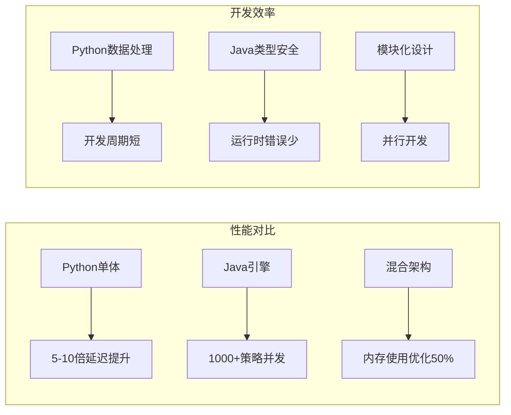
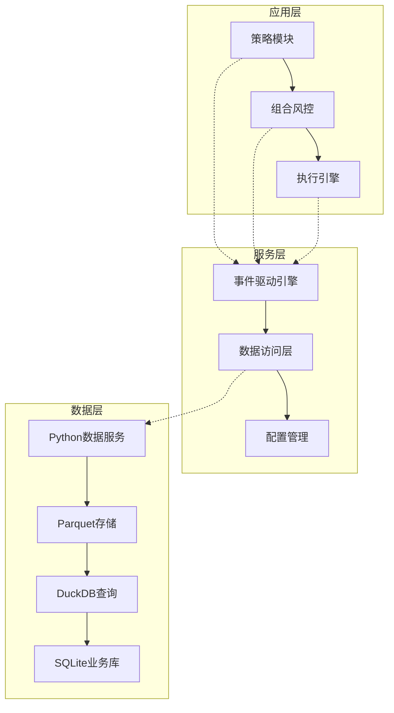
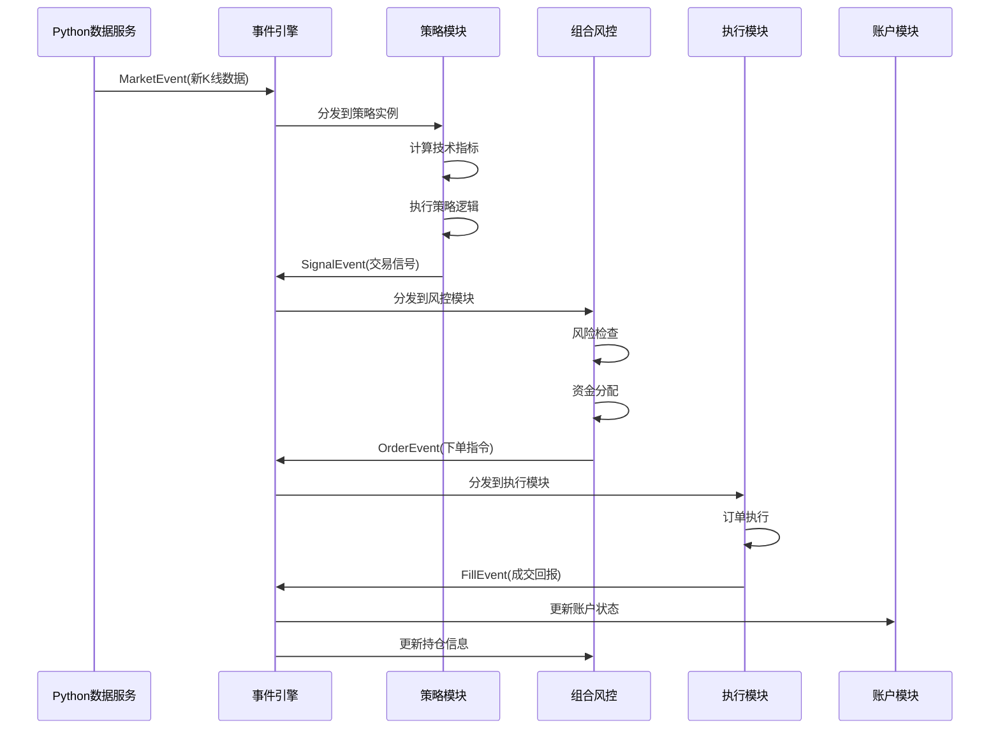
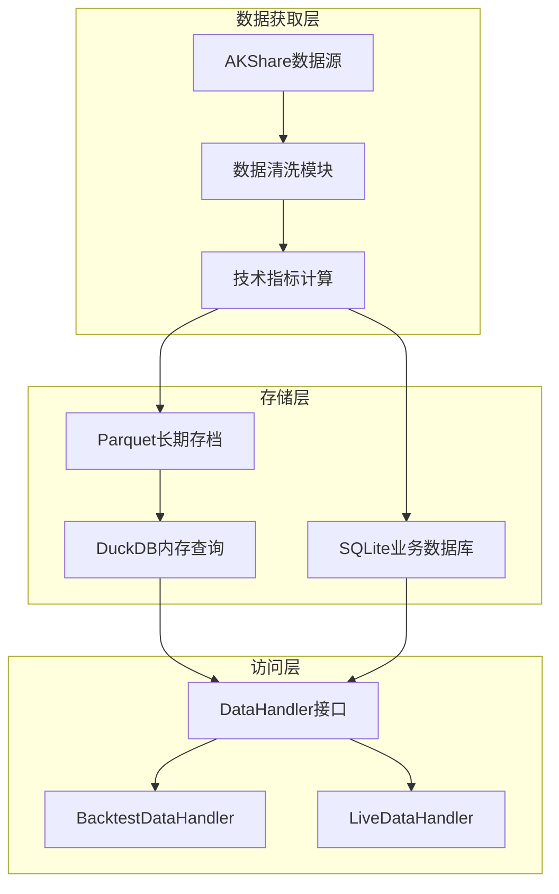

# QuantCapital 量化交易系统设计文档

## 📋 系统概述

### 设计理念

本量化交易系统采用Python+Java混合架构，基于以下核心设计理念：

1. **语言特长优化**：充分发挥Python数据处理优势和Java高性能计算能力
2. **事件驱动架构**：通过事件解耦各模块，实现高并发异步处理
3. **回测实盘一致性**：策略代码无需区分运行环境，确保逻辑一致性
4. **模块化设计**：各模块职责清晰，支持独立开发和测试
5. **性能与易用平衡**：在保证性能的前提下，维持开发的便利性

### 架构选型理由

#### Python+Java混合架构的优势

**Python职责**（数据处理层）

- 数据获取：AKShare等第三方数据源生态丰富
- 技术指标计算：TA-Lib等成熟库支持
- 数据清洗：Pandas强大的数据处理能力
- 报告生成：matplotlib、plotly等可视化生态

**Java职责**（核心交易引擎）

- 事件处理：高并发、低延迟的事件分发
- 策略执行：类型安全、内存可控的策略运行
- 风控管理：实时风险计算和控制
- 订单执行：稳定可靠的交易执行

#### 混合架构带来的性能提升



## 🏗️ 系统架构设计

### 整体架构原则

1. **进程分离原则**：数据获取进程与交易引擎进程独立运行，避免相互影响
2. **事件驱动原则**：所有模块间通信通过事件完成，实现松耦合
3. **数据一致性原则**：统一的数据格式和访问接口，确保数据质量
4. **故障隔离原则**：单个模块故障不影响整体系统运行
5. **可扩展性原则**：支持新策略、新数据源、新执行器的插件化扩展

### 系统层次架构



### 核心设计模式

#### 1. 事件驱动模式（Event-Driven）

**设计动机**：

- 解决模块间强耦合问题
- 支持异步处理，提高系统吞吐量
- 便于系统监控和调试

**实现架构**：

```java
// 事件引擎核心设计
public class EventEngine {
    // 虚拟线程池
    private final ExecutorService virtualThreadPool;
    
    // 事件分发队列
    private final BlockingQueue<Event> eventQueue;
    
    // 订阅者管理
    private final Map<String, List<EventHandler>> handlers;
}
```

#### 2. 策略模式（Strategy Pattern）

**设计动机**：

- 支持多种策略算法的动态切换
- 策略逻辑与执行框架解耦
- 便于策略的测试和验证

**分类设计**：

```java
public enum StrategyType {
    ENTRY,           // 开单策略：寻找新机会
    EXIT,            // 平仓策略：管理已有持仓
    UNIVERSAL_STOP   // 通用止损：兜底风控
}
```

#### 3. 模板方法模式（Template Method）

**设计动机**：

- 统一策略执行流程
- 允许子类自定义特定步骤
- 确保关键流程不被破坏

```java
public abstract class BaseStrategy {
    // 模板方法：定义固定流程
    public final void processMarketEvent(MarketEvent event) {
        if (!shouldProcess(event)) return;
        
        List<Signal> signals = generateSignals(event);
        for (Signal signal : signals) {
            validateAndSendSignal(signal);
        }
    }
    
    // 抽象方法：子类实现
    protected abstract List<Signal> generateSignals(MarketEvent event);
}
```

## 🔄 Java量化交易框架事件流架构

### 事件类型设计

#### 核心事件定义

**1. MarketEvent（市场数据事件）**

```java
public class MarketEvent extends Event {
    private final String symbol;        // 标的代码
    private final Bar latestBar;        // 最新K线数据
    private final Frequency frequency;  // 数据频率
    private final LocalDateTime timestamp;
}
```

- **设计理由**：将市场数据更新抽象为事件，支持多频率数据推送
- **触发时机**：数据更新进程获取到新的K线数据时
- **订阅者**：策略模块、指标计算模块

**2. SignalEvent（交易信号事件）**

```java
public class SignalEvent extends Event {
    private final String strategyId;            // 策略标识
    private final String symbol;                // 标的代码
    private final SignalDirection direction;    // 信号方向
    private final SignalStrengthLevel strength; // 信号强度
    private final BigDecimal referencePrice;    // 参考价格
    private final String reason;                // 信号原因
}
```

- **设计理由**：标准化策略输出，便于后续处理和审计
- **触发时机**：策略计算出有效交易信号时
- **订阅者**：组合风控模块

**3. OrderEvent（订单事件）**

```java
public class OrderEvent extends Event {
    private final String orderId;      // 订单ID
    private final String symbol;       // 标的代码
    private final OrderSide side;      // 买卖方向
    private final OrderType type;      // 订单类型
    private final Integer quantity;    // 订单数量
    private final BigDecimal price;    // 订单价格
}
```

- **设计理由**：将交易决策转化为具体的订单指令
- **触发时机**：组合风控模块通过风险检查后
- **订阅者**：执行模块

**4. FillEvent（成交事件）**

```java
public class FillEvent extends Event {
    private final String fillId;       // 成交ID
    private final String orderId;      // 关联订单ID
    private final String symbol;       // 标的代码
    private final Integer quantity;    // 成交数量
    private final BigDecimal price;    // 成交价格
    private final BigDecimal commission; // 手续费
}
```

- **设计理由**：记录实际成交结果，更新账户状态
- **触发时机**：订单执行完成时
- **订阅者**：账户模块、组合风控模块

### 事件流转设计

#### 完整流转流程



#### 事件引擎高性能设计

**虚拟线程架构**

```java
public class EventEngine {
    // 使用Java 24虚拟线程
    private final ExecutorService virtualThreadPool = 
        Executors.newVirtualThreadPerTaskExecutor();
    
    // 高性能事件分发
    public void publishEvent(Event event) {
        // 快速分发，不等待处理
        List<EventHandler> eventHandlers = handlers.get(event.getType());
        for (EventHandler handler : eventHandlers) {
            virtualThreadPool.submit(() -> {
                try {
                    handler.handleEvent(event);
                } catch (Exception e) {
                    // 故障隔离：单个处理器异常不影响其他
                    handleError(handler, event, e);
                }
            });
        }
    }
}
```

**背压处理机制**

- 队列容量限制：防止内存溢出
- 优先级处理：高优先级事件优先处理
- 丢弃策略：队列满时智能丢弃低优先级事件

## 🧩 核心模块设计

### 1. 策略模块设计

#### 策略分类与职责划分

**设计理念**：

- 单一职责原则：每种策略类型专注特定功能
- 避免职责重叠：开单策略不处理平仓逻辑
- 协同工作：多种策略类型配合形成完整交易系统

**策略类型定义**：

```java
public enum StrategyType {
    ENTRY("entry", "开单策略"),
    EXIT("exit", "平仓策略"),
    UNIVERSAL_STOP("universal_stop", "通用止损策略");
}
```

**职责边界**：

| 策略类型 | 关注标的 | 核心职责 | 设计考虑 |
|---------|---------|---------|---------|
| 开单策略 | 全市场 - 已持有 | 发现新机会 | 避免重复开单 |
| 平仓策略 | 本策略持仓 | 止盈止损管理 | 与开单策略配对 |
| 通用止损 | 所有持仓 | 兜底风控 | 防范极端风险 |

#### 策略协调机制设计

**动态标的范围更新**：

```java
public abstract class BaseStrategy implements EventHandler {
    protected Set<String> getWatchSymbols() {
        switch (this.strategyType) {
            case ENTRY:
                return getAllSymbols().stream()
                    .filter(symbol -> !hasPosition(symbol))
                    .collect(Collectors.toSet());
            case EXIT:
                return getPositions().stream()
                    .filter(pos -> pos.getStrategyId().equals(this.strategyId))
                    .map(Position::getSymbol)
                    .collect(Collectors.toSet());
            case UNIVERSAL_STOP:
                return getPositions().stream()
                    .map(Position::getSymbol)
                    .collect(Collectors.toSet());
        }
    }
}
```

**仓位标记系统**：

```java
public class Position {
    private String symbol;              // 标的代码
    private String entryStrategyId;     // 开仓策略ID
    private String exitStrategyId;      // 平仓策略ID（可选）
    private Integer quantity;           // 持仓数量
    private BigDecimal avgPrice;        // 平均成本
}
```

### 2. 组合风控模块设计

#### 设计职责

**信号处理与决策**：

```java
public class PortfolioManager implements EventHandler {
    
    @Override
    public void handleEvent(Event event) {
        if (event instanceof SignalEvent) {
            processSignal((SignalEvent) event);
        } else if (event instanceof FillEvent) {
            updatePosition((FillEvent) event);
        }
    }
    
    private void processSignal(SignalEvent signal) {
        // 1. 信号有效性检查
        if (!isValidSignal(signal)) return;
        
        // 2. 风险控制检查
        if (!passRiskCheck(signal)) return;
        
        // 3. 资金分配
        BigDecimal orderSize = calculateOrderSize(signal);
        
        // 4. 生成订单
        OrderEvent order = createOrder(signal, orderSize);
        eventEngine.publishEvent(order);
    }
}
```

#### 风控规则设计

**多层风控架构**：

```java
public class RiskManager {
    
    // 第一层：单标的风控
    public boolean checkSingleStockRisk(String symbol, BigDecimal orderValue) {
        BigDecimal currentValue = getCurrentPosition(symbol);
        BigDecimal totalValue = account.getTotalValue();
        
        return (currentValue.add(orderValue)).divide(totalValue)
            .compareTo(config.getSingleStockLimit()) <= 0;
    }
    
    // 第二层：策略组风控
    public boolean checkStrategyGroupRisk(String strategyId, BigDecimal orderValue) {
        BigDecimal strategyValue = getStrategyTotalValue(strategyId);
        BigDecimal totalValue = account.getTotalValue();
        
        return (strategyValue.add(orderValue)).divide(totalValue)
            .compareTo(config.getStrategyGroupLimit()) <= 0;
    }
    
    // 第三层：整体仓位风控
    public boolean checkTotalPositionRisk() {
        BigDecimal positionValue = account.getTotalPositionValue();
        BigDecimal totalValue = account.getTotalValue();
        
        return positionValue.divide(totalValue)
            .compareTo(config.getTotalPositionLimit()) <= 0;
    }
}
```

### 3. 执行模块设计

#### 执行器抽象设计

```java
public abstract class ExecutionHandler implements EventHandler {
    
    @Override
    public void handleEvent(Event event) {
        if (event instanceof OrderEvent) {
            executeOrder((OrderEvent) event);
        }
    }
    
    protected abstract void executeOrder(OrderEvent orderEvent);
    
    protected void sendFillEvent(Fill fill) {
        FillEvent fillEvent = new FillEvent(fill);
        eventEngine.publishEvent(fillEvent);
    }
}
```

#### 回测执行器设计

**市场特性模拟**：

```java
public class SimulatedExecutionHandler extends ExecutionHandler {
    
    @Override
    protected void executeOrder(OrderEvent orderEvent) {
        // 1. 延迟模拟
        simulateLatency();
        
        // 2. 滑点计算
        BigDecimal executionPrice = calculateSlippage(orderEvent);
        
        // 3. 部分成交模拟
        Integer filledQuantity = simulatePartialFill(orderEvent);
        
        // 4. 手续费计算
        BigDecimal commission = calculateCommission(orderEvent, filledQuantity);
        
        // 5. 生成成交
        Fill fill = createFill(orderEvent, executionPrice, filledQuantity, commission);
        sendFillEvent(fill);
    }
    
    private BigDecimal calculateSlippage(OrderEvent order) {
        BigDecimal basePrice = order.getPrice();
        BigDecimal slippageRate = config.getSlippageRate();
        
        if (order.getSide() == OrderSide.BUY) {
            return basePrice.multiply(BigDecimal.ONE.add(slippageRate));
        } else {
            return basePrice.multiply(BigDecimal.ONE.subtract(slippageRate));
        }
    }
}
```

### 4. 数据架构设计

#### 分层存储设计理念

**存储分层的设计动机**：

- **性能分层**：热数据内存访问，冷数据磁盘存储
- **查询分层**：OLAP查询用列存，OLTP操作用行存
- **成本分层**：常用数据快速访问，历史数据压缩存储

#### 数据流架构



#### 数据访问接口设计

**统一接口原则**：

```java
public interface DataHandler {
    
    // 避免未来函数：只能获取当前时间之前的数据
    List<Bar> getBars(String symbol, LocalDateTime start, LocalDateTime end, Frequency frequency);
    
    // 最新数据获取：回测返回模拟时间的数据，实盘返回真实最新数据
    Optional<Bar> getLatestBar(String symbol, Frequency frequency);
    
    // 批量数据获取：性能优化
    Map<String, List<Bar>> getLatestBars(Set<String> symbols, Frequency frequency, int count);
}
```

**回测与实盘实现差异**：

```java
// 回测实现：基于历史数据的时间模拟
public class BacktestDataHandler implements DataHandler {
    private LocalDateTime currentTime; // 模拟当前时间
    
    @Override
    public Optional<Bar> getLatestBar(String symbol, Frequency frequency) {
        return dataStore.getBars(symbol, frequency)
            .stream()
            .filter(bar -> !bar.getTimestamp().isAfter(currentTime))
            .max(Comparator.comparing(Bar::getTimestamp));
    }
}

// 实盘实现：基于实时数据
public class LiveDataHandler implements DataHandler {
    @Override
    public Optional<Bar> getLatestBar(String symbol, Frequency frequency) {
        return realTimeDataProvider.getCurrentBar(symbol, frequency);
    }
}
```

## 🚀 技术选型与实现

### Java技术栈选择

#### JDK 24 + ZGC的选择理由

**JDK 24关键特性**：

- **虚拟线程（Virtual Threads）**：支持百万级线程并发，非常适合事件驱动架构
- **模式匹配增强**：简化事件类型判断和处理逻辑
- **记录类（Record）**：简化实体类定义，减少样板代码

**ZGC垃圾回收器**：

- **低延迟**：GC停顿时间 < 10ms，满足高频交易需求
- **内存效率**：支持TB级内存，适合大量历史数据处理
- **并发回收**：GC与应用线程并发运行，减少性能影响

#### Spring Boot 3的集成考虑

**选择理由**：

- **配置管理**：强大的配置绑定和验证机制
- **依赖注入**：简化模块间依赖管理
- **监控集成**：内置监控指标和健康检查
- **生产就绪**：完善的生产环境支持

**核心配置设计**：

```yaml
quantcapital:
  data:
    root-path: /data/quantcapital
    cache-size: 1000
  
  execution:
    slippage-rate: 0.001
    commission-rate: 0.0003
    
  risk:
    single-stock-limit: 0.05
    strategy-group-limit: 0.20
    total-position-limit: 0.95
```

### Python技术栈选择

#### 数据处理库选择

**Pandas vs Polars权衡**：

- **Pandas**：生态成熟，AKShare等库支持好
- **Polars**：性能更优，但生态相对较新
- **选择策略**：主要使用Pandas，性能瓶颈处引入Polars

**存储技术选择**：

```python
# Parquet：列式存储，压缩比高，查询性能好
import pyarrow.parquet as pq

# DuckDB：内存分析数据库，SQL兼容性好
import duckdb

# SQLite：轻量级事务数据库，部署简单
import sqlite3
```

### 性能优化设计

#### Java性能优化策略

**JVM参数优化**：

```bash
# 生产环境JVM参数
java -XX:+UseZGC \
     -XX:+UnlockExperimentalVMOptions \
     -Xmx8g \
     -XX:MaxDirectMemorySize=2g \
     -jar trading-engine.jar
```

**内存管理优化**：

```java
// 对象池减少GC压力
public class EventPool {
    private final Queue<MarketEvent> marketEventPool = new ConcurrentLinkedQueue<>();
    
    public MarketEvent borrowMarketEvent() {
        MarketEvent event = marketEventPool.poll();
        return event != null ? event : new MarketEvent();
    }
    
    public void returnMarketEvent(MarketEvent event) {
        event.reset(); // 重置状态
        marketEventPool.offer(event);
    }
}
```

#### 数据访问优化

**缓存策略**：

```java
@Component
public class DataCache {
    // LRU缓存最近访问的K线数据
    private final Cache<String, List<Bar>> barCache = 
        Caffeine.newBuilder()
            .maximumSize(1000)
            .expireAfterAccess(1, TimeUnit.HOURS)
            .build();
}
```

**批量加载**：

```java
// 预加载策略：启动时加载热门股票数据
@PostConstruct
public void preloadData() {
    List<String> hotStocks = getHotStocks();
    
    hotStocks.parallelStream().forEach(symbol -> {
        List<Bar> bars = dataHandler.getBars(symbol, 
            LocalDateTime.now().minusMonths(6), 
            LocalDateTime.now(), 
            Frequency.DAILY);
        dataCache.put(symbol, bars);
    });
}
```

## 🔧 扩展性设计

### 插件化架构

#### 策略插件机制

```java
// 策略发现机制
@Component
public class StrategyRegistry {
    
    @EventListener
    public void onApplicationReady(ApplicationReadyEvent event) {
        // 扫描策略类
        Set<Class<?>> strategyClasses = 
            reflections.getSubTypesOf(BaseStrategy.class);
        
        // 注册策略实例
        for (Class<?> clazz : strategyClasses) {
            if (clazz.isAnnotationPresent(Strategy.class)) {
                registerStrategy(clazz);
            }
        }
    }
}

// 策略注解
@Target(ElementType.TYPE)
@Retention(RetentionPolicy.RUNTIME)
public @interface Strategy {
    String value();                    // 策略名称
    StrategyType type();              // 策略类型
    String[] dependencies() default {}; // 依赖策略
}
```

#### 数据源扩展机制

```java
// 数据源接口
public interface DataSource {
    String getName();
    List<String> getSupportedSymbols();
    List<Bar> fetchBars(String symbol, LocalDateTime start, LocalDateTime end);
}

// 数据源管理器
@Component
public class DataSourceManager {
    private final Map<String, DataSource> dataSources = new HashMap<>();
    
    @Autowired
    public DataSourceManager(List<DataSource> sources) {
        sources.forEach(source -> 
            dataSources.put(source.getName(), source));
    }
}
```

### 配置驱动设计

#### 多环境配置支持

```yaml
# application-backtest.yml
quantcapital:
  mode: backtest
  data:
    handler: backtest
    start-date: 2020-01-01
    end-date: 2024-12-31
  
  execution:
    handler: simulated
    enable-slippage: true

---
# application-live.yml  
quantcapital:
  mode: live
  data:
    handler: live
    refresh-interval: 1s
  
  execution:
    handler: miniQMT
    enable-real-trading: true
```

#### 动态配置更新

```java
@Component
@ConfigurationProperties(prefix = "quantcapital")
public class QuantCapitalConfig {
    
    @EventListener
    public void onConfigChanged(ConfigChangedEvent event) {
        // 重新加载配置
        refreshConfiguration();
        
        // 通知相关组件
        applicationEventPublisher.publishEvent(
            new ConfigUpdatedEvent(this));
    }
}
```

## 📊 监控与可观测性

### 监控指标设计

#### 业务指标监控

```java
@Component
public class TradingMetrics {
    
    private final MeterRegistry meterRegistry;
    
    // 事件处理延迟监控
    private final Timer eventProcessingTimer;
    
    // 订单执行统计
    private final Counter orderExecutedCounter;
    
    // 策略信号统计
    private final Gauge activeStrategiesGauge;
    
    public void recordEventProcessing(String eventType, Duration duration) {
        eventProcessingTimer.record(duration);
    }
}
```

#### 系统健康检查

```java
@Component
public class TradingHealthIndicator implements HealthIndicator {
    
    @Override
    public Health health() {
        Health.Builder builder = new Health.Builder();
        
        // 检查事件引擎状态
        if (eventEngine.isRunning()) {
            builder.up();
        } else {
            builder.down().withDetail("event-engine", "stopped");
        }
        
        // 检查数据连接状态  
        if (dataHandler.isConnected()) {
            builder.up();
        } else {
            builder.down().withDetail("data-connection", "disconnected");
        }
        
        return builder.build();
    }
}
```

### 日志设计

#### 结构化日志

```java
// 交易日志记录
@Slf4j
public class TradingLogger {
    
    public void logSignal(SignalEvent signal) {
        MDC.put("event_type", "SIGNAL");
        MDC.put("strategy_id", signal.getStrategyId());
        MDC.put("symbol", signal.getSymbol());
        
        log.info("Strategy signal generated: direction={}, strength={}, reason={}", 
            signal.getDirection(), 
            signal.getStrength(), 
            signal.getReason());
            
        MDC.clear();
    }
    
    public void logOrder(OrderEvent order) {
        MDC.put("event_type", "ORDER");
        MDC.put("order_id", order.getOrderId());
        
        log.info("Order placed: side={}, quantity={}, price={}", 
            order.getSide(), 
            order.getQuantity(), 
            order.getPrice());
            
        MDC.clear();
    }
}
```

## 🎯 未来扩展路线

- MiniQMT实盘对接
- 可视化增强：实时监控、报告可视化、复盘可视化

---

本设计文档详细阐述了QuantCapital量化交易系统的架构设计思路、技术选型和实现策略。通过Python+Java混合架构，系统实现了高性能与易用性的平衡，为量化交易提供了坚实的技术基础。
